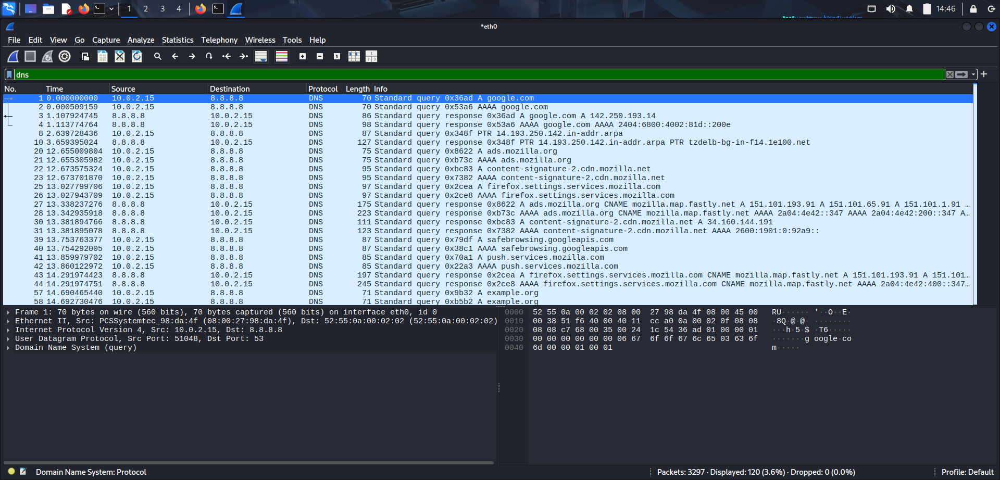

## 🌍 2. DNS Analysis

### Objective
Observe DNS queries and responses.

**Filter Used**

```text
dns
```

### Screenshot



### Key Observations

- DNS converts domain names into IP addresses.
- Query and Response packets can be identified.
- DNS typically uses UDP port 53.
