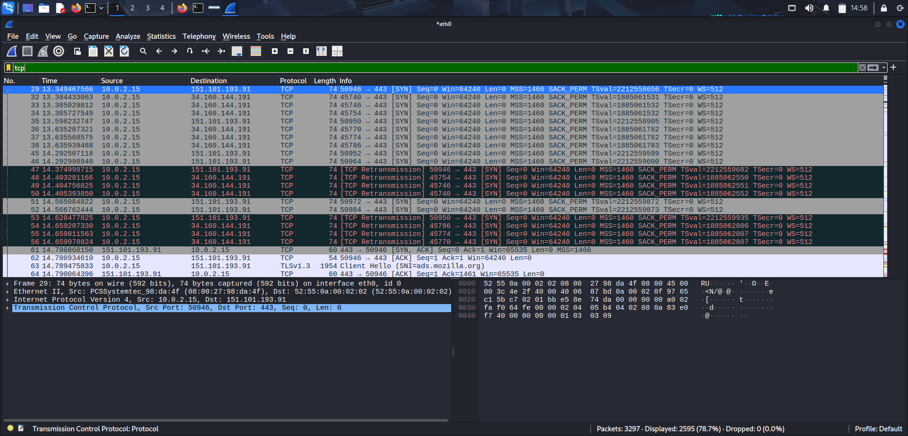

## 🤝 3. TCP Analysis

### Objective
Analyze TCP communication and the three-way handshake.

**Filter Used**

```text
tcp
```

### Screenshot



### Key Observations

- SYN
- SYN-ACK
- ACK
- Reliable connection-oriented communication.
