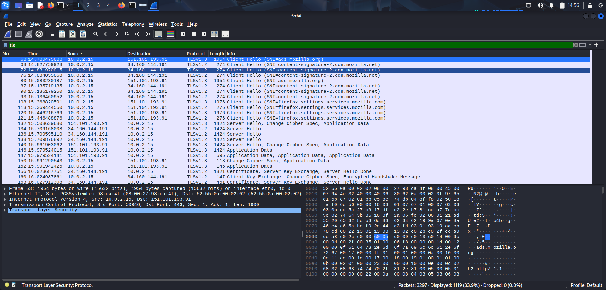

## 🔒 4. TLS Analysis

### Objective
Inspect encrypted HTTPS communication.

**Filter Used**

```text
tls
```

### Screenshot



### Key Observations

- Client Hello
- Server Hello
- Certificate exchange
- Encrypted communication after the handshake.
